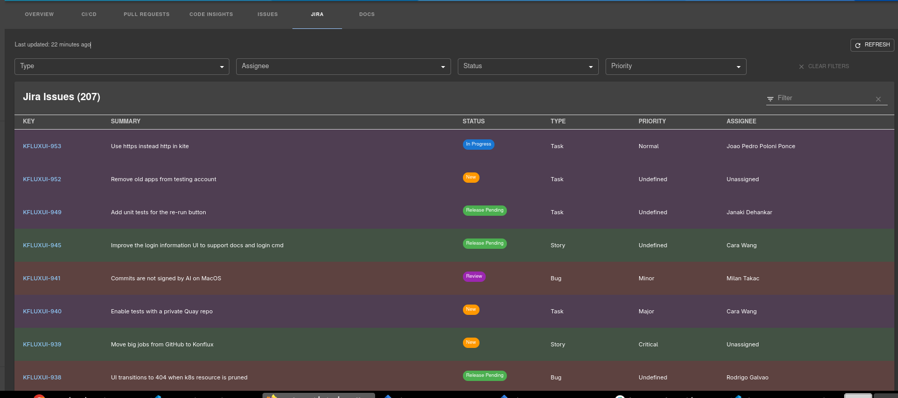

# Backstage Jira Plugin

A Backstage plugin for displaying and managing Jira issues directly in your software catalog.


## Features

- 📊 Display Jira issues with `jira/project-key` annotation
- 🔍 Filter by Type, Assignee, Status, and Priority
- 💾 3-hour local cache to reduce API calls
- 🔄 Manual refresh button
- 🌓 Dark mode support
- 🎨 Color-coded status chips and issue type rows
- 📑 Sortable, searchable, paginated table
- 🚀 Supports up to 1000 issues per project
- 🎯 Auto-excludes Closed/Resolved/Done issues

## Screenshots



## Plugins

This repository contains two plugins:

- **[@testcara/plugin-jira-issues](./jira-issues)** - Frontend plugin for displaying Jira issues
- **[@testcara/plugin-jira-issues-backend](./jira-issues-backend)** - Backend plugin for Jira API integration

## Installation

### 1. Install the plugins

```bash
# From your Backstage root directory
yarn workspace app add https://github.com/testcara/backstage-jira-plugin.git#subdirectory=jira-issues
yarn workspace backend add https://github.com/testcara/backstage-jira-plugin.git#subdirectory=jira-issues-backend
```

### 2. Configure Jira integration

Add to your `app-config.yaml`:

```yaml
integrations:
  jira:
    baseUrl: https://your-jira-instance.com
    apiToken: ${JIRA_TOKEN}
```

> **Tip:** Generate a Jira API token at https://id.atlassian.com/manage-profile/security/api-tokens and set it as `JIRA_TOKEN` environment variable.

### 3. Add the backend plugin

In `packages/backend/src/index.ts`:

```typescript
import { jiraIssuesBackendPlugin } from "@testcara/plugin-jira-issues-backend";

backend.add(jiraIssuesBackendPlugin);
```

### 4. Add the frontend component

In `packages/app/src/components/catalog/EntityPage.tsx`:

```typescript
import { JiraIssuesCard } from "@testcara/plugin-jira-issues";

// Add a new tab to your service entity page
<EntityLayout.Route path="/jira" title="Jira">
  <Grid container spacing={3}>
    <Grid item xs={12}>
      <JiraIssuesCard />
    </Grid>
  </Grid>
</EntityLayout.Route>;
```

### 5. Annotate your entities

Add the `jira/project-key` annotation to your catalog entities:

```yaml
apiVersion: backstage.io/v1alpha1
kind: Component
metadata:
  name: my-service
  annotations:
    jira/project-key: MYPROJ
spec:
  type: service
  owner: team-a
```

## Usage

Navigate to any component with a `jira/project-key` annotation and click the **Jira** tab.

### Filtering Examples

- **View only Spikes**: Select "Spike" in Type filter
- **View your Spikes**: Select "Spike" + your name in Assignee
- **Critical bugs in progress**: Select "Bug" + "In Progress" + "Critical"

## Development

### Local Development

Copy the plugin folders to your Backstage `plugins/` directory, configure frontend and backend as described in [Installation](#installation), develop and test. Copy back when done.

### API Endpoints

- `GET /api/jira-issues/test` - Health check
- `GET /api/jira-issues/issues/:projectKey` - Fetch issues for a project


## Requirements

- Backstage 1.x or higher
- Jira Cloud or Server with API access
- Jira API token with read permissions

## Troubleshooting

**No issues showing up?**
- Verify `jira/project-key` annotation is correct
- Check browser console and backend logs for errors
- Ensure `JIRA_TOKEN` has permissions to access the project

**Authentication errors?**
- Verify `JIRA_TOKEN` environment variable is set
- Check `integrations.jira.baseUrl` in app-config.yaml

## Contributing

Contributions welcome! Please submit a Pull Request or [open an issue](https://github.com/testcara/backstage-jira-plugin/issues).

## License

Apache-2.0 - see [LICENSE](LICENSE) file.
